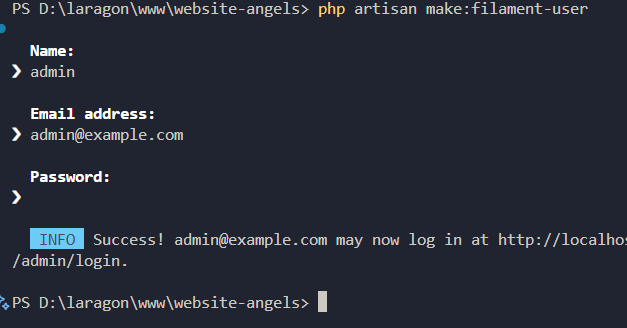
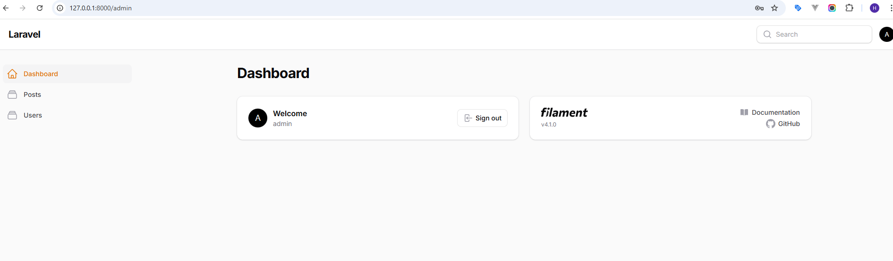
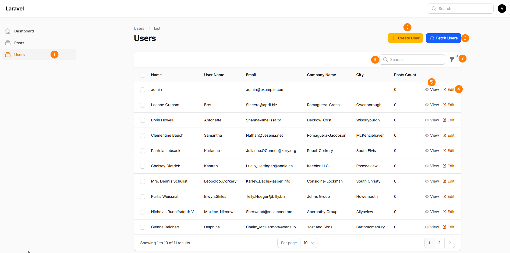
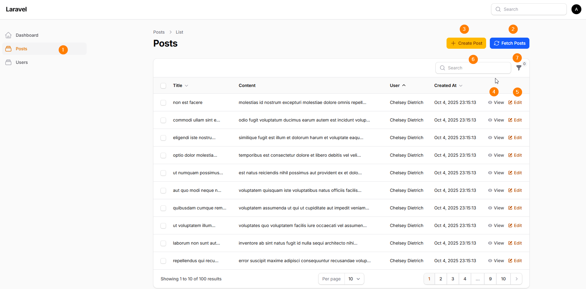

#Website Angels

## Setup Instructions

### Requirements
- PHP 8.3 or higher
- Composer
- Node.js and NPM
- SQLite/ MySQL (change the .env file if you are using MySQL)

### Installation
- Clone the repository.
- Go to the website-angels directory.
- Open a terminal.
- Run `composer install`
- Generate application key using.
    `php artisan key:generate`
- Run the migrations.
    `php artisan migrate:fresh`

### Run the Application
- Start server.
    `php artisan serve`
- Go the admin panel on browser. 
    `http://127.0.0.1:8000/admin/login`
- Create an Admin user.
    `php artisan make:filament-user`
    - Terminal asks Name, Email address, and Password.
    - Then it will generate the admin user.

### How to Use
- Go to the browser and login.
- You will see below screen.

- Click on `Users` on the left side menu to see the users.
- Click on `Fetch Users` button (No. 2) to pull the users from `jsonplaceholder` and update the users table.

- You can do User Create, Update, View, Delete, Search, and Filter By City (refer above image).
- Click on the `Posts` on the left side menu to see the posts. 
- Click on `Fetch Post` button to pull post data fron jsonplaceholder and update the posts table.

-  You can do Post Create, Update, View, Delete, Search, Sort (Title, User, and Created At), and Filter By User (refer above image).

### How I Developed This Application
- Install Laravel using `laravel new website-angels`
- Went to `website-angels` directory.
- Opened vs code.
- Updated the .env file in the project.
- Run the migration.
- Install Filaments. 
    `composer require filament/filament:"~4.0"`
    `php artisan filament:install --panels`
- Create a Admin User
    `php artisan make:filament-user`
- Logged in to admin panel.
- Created 2 migrations (enhance_users and posts) and migrated them.
- Created the Post model and updated the User model
- Generated Users Resource `php artisan make:filament-resource User --generate --soft-deletes --view`   
- Then added a `Fetch User` button to `ListUsers` page inside the Filament resources
- Created a protected method `fetchDataFromApi` to pull data from jsonplaceholder and updated the users table.
- Added Notification, icon, color and etc...
- Added `User Name, Company Name, City` to the UsersTable.php file in filament resource 
- Added City filter. In here, I'm pulling all the cities from users table.
- Then updated the User schemas.
- Generated Post Resource and updated the Schemas, PostTable, ListPost and PostResource.
- Then I added post Count to the UsersTable.
- After that, I Created a APIService class to add the DRY principle and then it is easy to maintain. (Note: When we have to include more APIs, we have to refactor this code slightly).

- Installed the pests and it's dependencies.
- Wrote tests for User.
- Updated the UserFactory.
- Started to write tests for Posts and created a factory for Post.
- Found the issue on Post fetching and updating function and fixed it.
- Created 3 Feature test files and 20 testcases with 86 assertions

